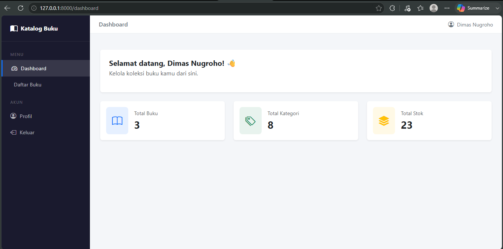
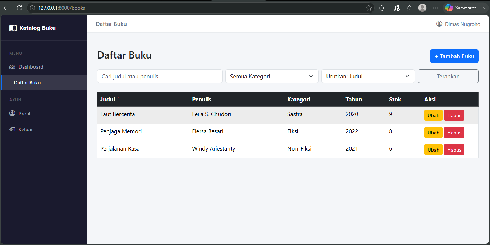
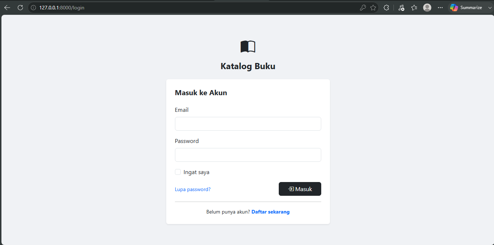

# 📚 Katalog Buku

**Posisi yang dilamar: Frontend**

Aplikasi web manajemen katalog buku berbasis Laravel. Pengguna dapat mengelola data buku dengan fitur tambah, lihat, ubah, dan hapus (CRUD), dilengkapi pencarian, filter kategori, dan pengurutan data.

---

## 🛠️ Tech Stack

| Komponen | Teknologi | Versi |
|---|---|---|
| Framework Backend | Laravel | 13.17.0 |
| Bahasa | PHP | 8.3.30 |
| Database | MySQL | 8.0 |
| Frontend | Bootstrap | 5.3.3 |
| Icons | Bootstrap Icons | 1.11.3 |
| Auth | Laravel Breeze | 2.4.2 |
| Runtime JS | Node.js | 24.18.0 |

---

## ✅ Fitur

### Wajib
- CRUD lengkap: tambah, tampilkan daftar, ubah, dan hapus buku
- Setiap buku memiliki kolom: judul, penulis, kategori, tahun terbit, stok, deskripsi
- Validasi input di sisi server (FormRequest)
- Filter berdasarkan kategori dan pengurutan berdasarkan kolom (judul, penulis, tahun, stok)

### Nilai Tambah
- ✅ Login dan registrasi pengguna (Laravel Breeze)
- ✅ Pencarian berdasarkan judul atau nama penulis
- ✅ Endpoint JSON: `GET /api/books`
- ✅ Tampilan responsif (Bootstrap 5)
- ✅ Relasi antar tabel: `books` → `categories`

---

## ⚙️ Instalasi

### 1. Clone repository
```bash
git clone https://github.com/username/katalog_buku.git
cd katalog_buku
```

### 2. Install dependencies PHP
```bash
composer install
```

### 3. Install dependencies Node.js
```bash
npm install
```

### 4. Salin file environment
```bash
cp .env.example .env
```

### 5. Generate application key
```bash
php artisan key:generate
```

### 6. Konfigurasi database

Buka file `.env` dan sesuaikan:
```env
DB_CONNECTION=mysql
DB_HOST=127.0.0.1
DB_PORT=3306
DB_DATABASE=katalog_buku
DB_USERNAME=root
DB_PASSWORD=
```

### 7. Jalankan migration dan seeder
```bash
php artisan migrate --seed
```

### 8. Build assets
```bash
npm run build
```

### 9. Jalankan server
```bash
php artisan serve
```

---

## 🌐 Akses Aplikasi

| URL | Keterangan |
|---|---|
| `http://localhost:8000` | Halaman utama (redirect ke daftar buku) |
| `http://localhost:8000/books` | Daftar buku |
| `http://localhost:8000/login` | Halaman login |
| `http://localhost:8000/register` | Halaman registrasi |
| `http://localhost:8000/api/books` | Endpoint JSON daftar buku |

### Akun default (setelah seeder)
- **Email:** `test@example.com`
- **Password:** `password`

---

## 📸 Tangkapan Layar

### Halaman Dashboard


### Halaman Daftar Buku


### Halaman Login


---

## 🗃️ Struktur Database

### Tabel `categories`
| Kolom | Tipe | Keterangan |
|---|---|---|
| id | bigint | Primary key |
| name | varchar | Nama kategori |
| slug | varchar | Slug unik kategori |

### Tabel `books`
| Kolom | Tipe | Keterangan |
|---|---|---|
| id | bigint | Primary key |
| category_id | bigint | Foreign key ke categories |
| title | varchar | Judul buku |
| author | varchar | Nama penulis |
| year | integer | Tahun terbit |
| stock | integer | Jumlah stok |
| description | text | Deskripsi buku (opsional) |

---

## 📝 Catatan

Seluruh fitur wajib telah selesai dikerjakan. Fitur foto profil tidak diimplementasikan karena memerlukan konfigurasi storage tambahan dan dianggap tidak krusial untuk kebutuhan aplikasi ini.
